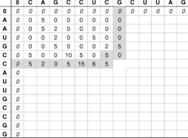
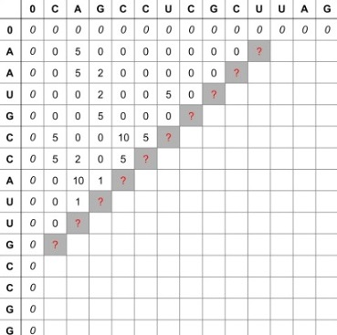

# PyCuda-parallelization-of-the-Smith-waterman-algorithm
This is a university project, a parallel implementation of the Smith-waterman algorithm 
 
To run this project you can take the "PyCuda.ipynb" file and open it in Google colab. 
 
### What we're calculating sequentially:

 
### How it can be done parallelly

